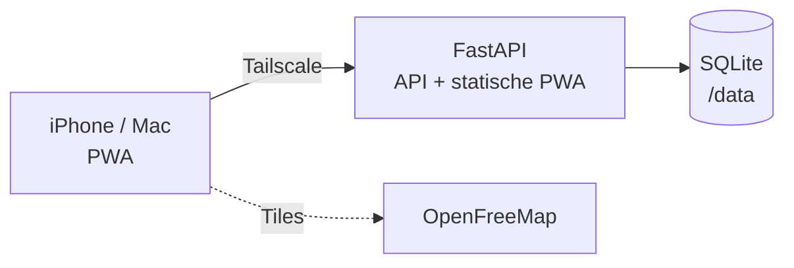

# 🚐 Camper-Reiseplaner

Kleine, self-hosted **PWA** zum Planen von Camper-Reisen: Reisen mit mehreren Stopps,
Kartenansicht (MapLibre GL + OpenFreeMap, **kostenlos, kein API-Key**), Marker farblich
nach Status und pro Stopp Deep-Links „In Apple Maps öffnen" / „In Google Maps öffnen".

Single-User (Olli & Anja), Zugriffskontrolle über **Tailscale** – kein Login im Backend.

## Architektur

- **Ein Container** (`backend/Dockerfile`): FastAPI serviert die REST-API *und* die
  gebaute PWA statisch. Daten in **SQLite** (`/data/camper.db`, Docker-Volume).
- **Frontend** (`frontend/`): statische PWA, MapLibre GL JS, Service-Worker
  (Offline **nur lesen**), Web-App-Manifest (installierbar auf iPhone & Mac).
- Kein bezahlter Kartendienst: Vektor-Tiles von [OpenFreeMap](https://openfreemap.org).



## Datenmodell

- **trip**: id, name, beschreibung, start_datum, end_datum
- **stop**: id, trip_id, name, lat, lng, status (`geplant`/`besucht`/`reserviert`), notiz, datum, reihenfolge

## Lokal starten

```bash
docker compose up --build
# -> http://localhost:8082
```

## API (Kurzüberblick)

| Methode | Pfad | Zweck |
|---|---|---|
| GET | `/api/health` | Healthcheck |
| GET/POST | `/api/trips` | Reisen listen / anlegen |
| GET/PATCH/DELETE | `/api/trips/{id}` | Reise lesen / ändern / löschen |
| GET/POST | `/api/trips/{id}/stops` | Stopps einer Reise |
| PATCH/DELETE | `/api/stops/{id}` | Stopp ändern / löschen |

## Tests

```bash
cd backend && pip install -r requirements.txt pytest && PYTHONPATH=. pytest -q
```

## Deployment (Homelab)

- Läuft auf **dockermsa2** via `docker compose` (Deploy: Scooter).
- Erreichbarkeit intern/Tailnet + TLS (`camper.dorf27.com`): Lew Zealand.
- SQLite-Datei `/data/camper.db` wird vom Backup-System mitgesichert.

## Nicht-Ziele

- Keine kostenpflichtigen Dienste, kein Multi-Tenant, kein eigenes Login
  (Tailscale übernimmt die Zugriffskontrolle). Offline-**Bearbeiten** ist v1 bewusst nicht dabei.
